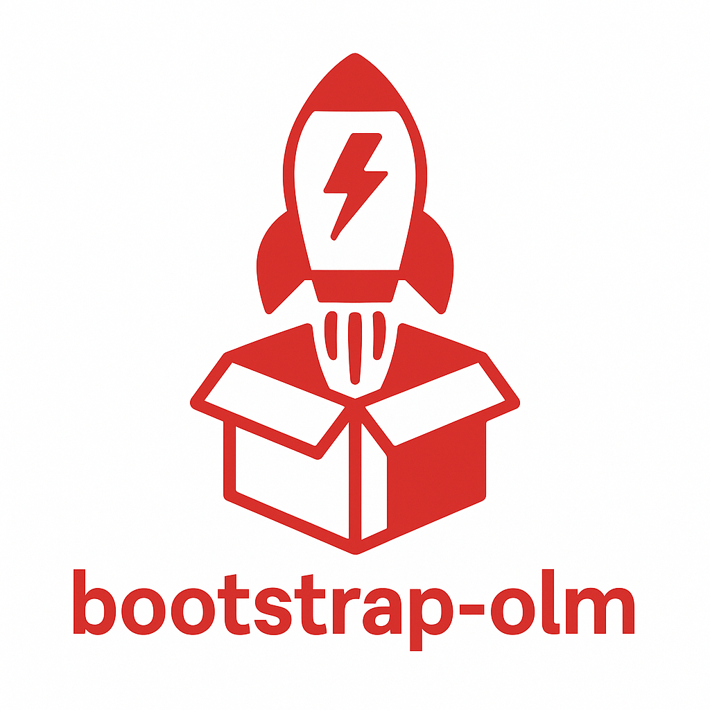

# bootstrap-olm

A simple way to bootstrap (install) OLM (Operator Lifecycle Manager)
in a non-OpenShift cluster.

## Getting Started

_This page and project are under active development, please come back later!_
